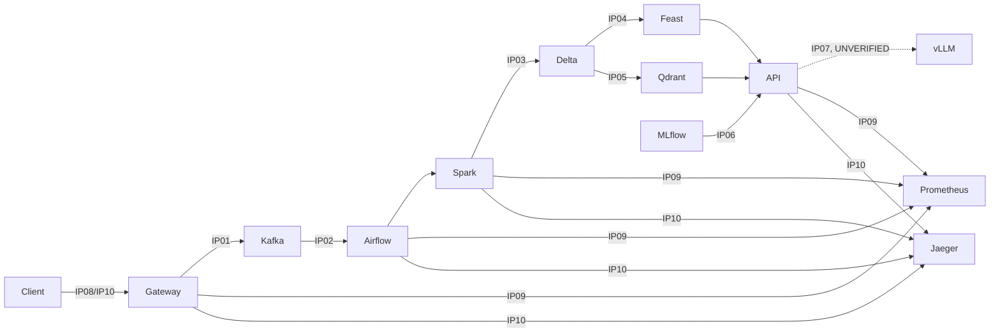

# Báo cáo nộp bài — Day 28 Track 2

## Thông tin và phạm vi xác minh

- Repository: `Day28-2A202601992-PhungVanLinh`
- Nhánh kiểm tra: `main`
- Người thực hiện: Phùng Văn Linh
- Python: 3.11.9
- Môi trường live: Docker Compose profile `full`, không có GPU/vLLM và không có LangSmith credential.

## Kết quả kiểm tra

| Hạng mục | Kết quả |
|---|---|
| Starter tests | PASS — 4 tests |
| Unit tests | PASS — 83 tests |
| Ruff | PASS |
| Integration matrix | PASS — 245 checks |
| Portability contract | PASS |
| Kubernetes/GitOps manifests | PASS |
| Docker Compose render | PASS |
| Full non-GPU/non-LangSmith integration | PASS — 56 tests, 16 deselected, 212.01 giây |

Golden path chạy riêng đạt 12 tests, 3 GPU tests bị deselect. Evidence live cho IP01–IP06 và IP08–IP10 nằm trong `evidence/`. IP07 được giữ đúng trạng thái `UNVERIFIED/not_ready` vì không có endpoint vLLM thật; không giả lập bằng một API tương thích OpenAI.

Readiness report sau khi tạo evidence đạt 83 điểm: IP01, IP03, IP04, IP05 và IP06 `ready`; IP02, IP08, IP09, IP10 cần evidence ngoài tiến trình và đã được integration tests tạo; IP07 `not_ready` do vLLM không khả dụng.

## Happy path và ownership

| Owner | Điểm tích hợp |
|---|---|
| team-ingestion | IP01, IP02 |
| team-data | IP03, IP04, IP06 |
| team-serving | IP05, IP07 |
| team-platform | IP08, IP09, IP10 |

Các file IP01, IP02, IP03, IP04, IP05, IP06, IP08, IP09 và IP10 chứa run/trace/version live tương ứng. MLflow champion là `lab28-rag-release` version 2. Delta ở thời điểm chốt evidence: documents version 6/18 rows và feedback version 12/23 rows.

## Failure/recovery và không mất dữ liệu

Bộ journey integration đã kiểm tra retry/idempotency, component outage, readiness và recovery. Lần chạy đầu sau seed có backlog nên DAG giới hạn batch xử lý dữ liệu seed trước dữ liệu golden-path. Không có dữ liệu bị mất: pipeline tiếp tục tiêu thụ backlog; chạy lại golden-path đạt 12/12 bài non-GPU, và toàn bộ suite sau đó đạt 56/56 bài được chọn. Delta MERGE giữ đúng một hàng trên mỗi `idempotency_key`.

## Load profile

Lệnh: `python load-tests/run_profile.py --url http://localhost:8080 --requests 200 --workers 8`.

- HTTP 200: 46/200; timeout/lỗi kết nối (status 0): 154/200.
- P50: 13.26 ms; P95: 921.20 ms; P99: 3598.33 ms.
- Các container vẫn hoạt động sau phép thử và `/ready` trả HTTP 200 với trạng thái tổng thể `degraded`.
- Bottleneck chính: `/ready` thực hiện fan-out đồng bộ đến Kafka, Feast, Qdrant, MLflow và inference cho mỗi request. Khi 8 worker gọi liên tục, các dependency nặng và Docker Desktop cục bộ bị cạnh tranh CPU/RAM/I/O; probe phía client có timeout 10 giây.
- Hướng production: tách liveness khỏi readiness sâu, cache kết quả dependency trong khoảng ngắn, đặt timeout/circuit breaker theo dependency, giới hạn đồng thời và cấp tài nguyên riêng cho Feast/Qdrant.

## Checklist

- [x] 10 tên evidence theo integration matrix; IP07 ghi rõ không xác minh.
- [x] Architecture/ownership diagram.
- [x] Happy path có run ID, trace ID, Delta và MLflow version trong evidence.
- [x] Failure/recovery và no-data-loss proof.
- [x] Load profile P50/P95/P99 và phân tích bottleneck.
- [x] Kubernetes/GitOps validation.
- [x] `ANSWERS.md` có trade-offs, production gaps và contribution.
- [x] `.gitignore` loại secret/cache/runtime nhưng không loại evidence nộp bài.
